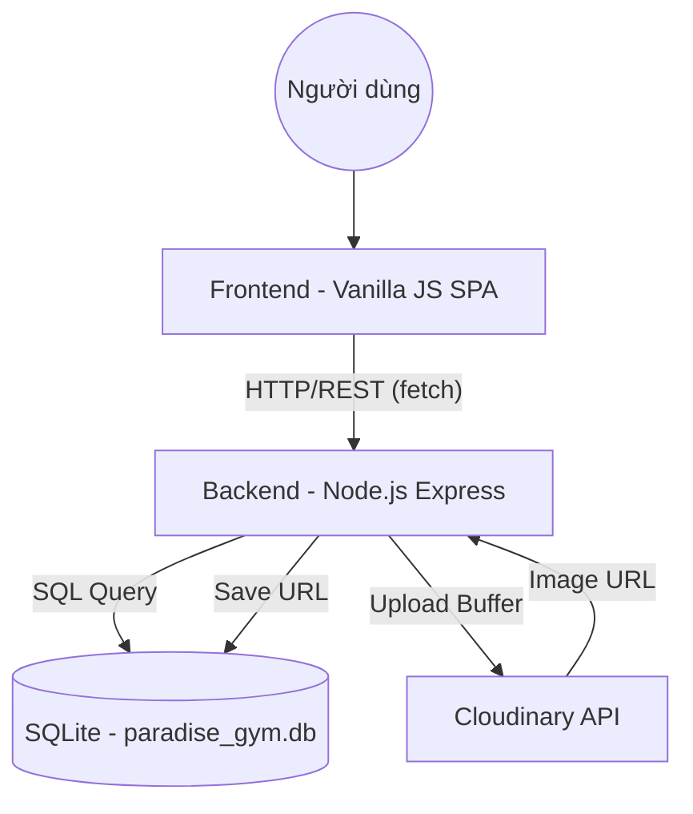

# 🏛️ Kiến Trúc Hệ Thống — Paradise GYM

> Cập nhật lần cuối: 14/05/2026 — Đồng bộ hệ thống QR Check-in/out ca làm việc cho PT & Hội viên trên cả Web Portal và Mobile App (tự động làm mới 5 phút, tự nhận diện vào/ra).

---

## 1. Tổng Quan Dự Án

- **Tên**: Paradise GYM Management System
- **Mục tiêu**: Hệ thống quản lý phòng gym toàn diện (Hội viên, PT, Gói tập, Lịch tập, Doanh thu).
- **Stack chính**: 
    - **Frontend**: HTML5, Vanilla JS (SPA), Tailwind CSS (Design System Material 3).
    - **Backend**: Node.js (ESM), Express.
    - **Database**: SQLite (better-sqlite3) + Cloudinary (Image Storage).

---

## 2. Sơ Đồ Kiến Trúc Tổng Thể

---

## 3. Các Thành Phần Hệ Thống

### 3.1. Frontend (Multi-Portal SPA Architecture)
- **Vị trí**: `FE/`
- **3 Portal riêng biệt theo role**:
    - `index.html` + `assets/js/app.js` — Admin / Lễ tân (toàn quyền quản lý)
    - `pt-portal.html` + `assets/js/pt-portal.js` — PT (xem lịch cá nhân, học viên, hồ sơ)
    - `member-portal.html` + `assets/js/member-portal.js` — Hội viên (xem gói tập, lịch tập, vào/ra, hồ sơ)
- **Dữ liệu**: `assets/js/api.js` (Fetch wrapper) & `assets/js/auth.js` (Auth + redirect theo role).
- **Styles**: Tailwind CDN + `assets/css/main.css` — Custom Material 3 Glassmorphism components.
- **Logic trang Admin**: `assets/js/pages/*.js` — Các module chức năng riêng biệt.

### 3.2. Backend (REST API)
- **Vị trí**: `BE/`
- **Controller/Route**: Chia theo module nghiệp vụ (auth, members, packages, v.v.).
- **Middleware**:
    - `auth.js`: Xác thực JWT.
    - `role.js`: Phân quyền dựa trên `quyen_json`.
    - `upload.js`: Multer memory storage.
    - `audit.js`: Ghi nhật ký hành động nhạy cảm.

### 3.3. Database
- **Engine**: SQLite (tối ưu WAL mode cho hiệu năng cao).
- **Schema**: `paradise_gym_v2.sql`.
- **Triggers**: Tự động tính doanh thu và cập nhật trạng thái gói tập.

---

## 4. Cơ Sở Dữ Liệu (Bảng chính)

| Tên bảng | Mô tả |
|----------|-------|
| `tai_khoan` | Tài khoản đăng nhập (Hashed password). |
| `ho_so` | Thông tin cá nhân Hội viên / PT / Nhân viên. |
| `vai_tro` | Phân quyền hệ thống (JSON-based RBAC). |
| `goi_tap` | Danh mục gói tập phòng gym. |
| `dang_ky_goi_tap`| Lịch sử đăng ký và thanh toán của hội viên. |
| `lich_tap` | Chi tiết các buổi tập của hội viên với PT. |
| `doanh_thu` | Tổng hợp doanh thu tự động qua Triggers. |
| `audit_log` | Nhật ký thay đổi dữ liệu nhạy cảm. |
| `cau_hinh` | Cấu hình hệ thống (giờ cron, TTL QR, v.v.). |
| `thong_bao` | Thông báo hệ thống: **16 loại** (6 cron + 10 realtime), phân quyền admin/le_tan/ca_hai, tự động xóa sau 30 ngày. Migration v4 bổ sung `cap_nhat_buoi_tap`. |

---

## 5. Danh Sách API Endpoints (Tóm tắt)

| Module | Endpoints | Chức năng chính |
|--------|-----------|-----------------|
| **Auth** | `/api/auth/login`, `/me`, `/doi-mat-khau` | Xác thực, phân quyền. |
| **Members** | `/api/members`, `/:id/package`, `/:id/avatar`, `/birthday`, `/me/profile` | Quản lý hội viên, đăng ký gói, sinh nhật, tự xem hồ sơ. |
| **Trainers** | `/api/trainers`, `/:id/schedules` | Quản lý PT và lịch dạy. |
| **PT Schedules** | `/api/pt/schedules`, `PATCH /:id/hoan-tac` | Đặt lịch tập, xác nhận, hủy, hoàn tác buổi tập. |
| **PT Registrations** | `/api/pt/registrations`, `/:id/cancel` | Đăng ký gói PT, hủy đăng ký. |
| **Staff** | `/api/staff` | Quản lý nhân viên lễ tân/nội bộ. |
| **Checkins** | `/api/checkins`, `/stats` | Vào-ra, biểu đồ mật độ. |
| **QR Check-in** | `/api/checkin/my-qr`, `/api/checkin/scan` | Hội viên lấy QR token; lễ tân quét xác nhận vào. |
| **PT Schedules** (thêm) | `PATCH /api/pt/schedules/:id/hoan-tac` | Hoàn tác buổi do cron tự xác nhận. |
| **Revenue** | `/api/revenue`, `/dashboard` | Thống kê doanh thu. |
| **Notifications** | `GET /api/notifications`, `/unread-count`, `/summary`; `PATCH /:id/read`, `/read-all` | Bell icon: danh sách, badge polling, summary login, đánh dấu đã đọc. |
| **Portal Notifications** | `GET /api/members/me/notifications` | Realtime không lưu DB: Banner Card Member Portal + Bell Icon PT Portal. |

---

## 6. Chức Năng Đã Hoàn Thành

### Frontend (UI/UX)
- [x] Giao diện SPA Material 3 (Glassmorphism).
- [x] Sidebar đóng/mở mượt mà, hỗ trợ Tooltip.
- [x] Dark/Light mode (Persistence).
- [x] Form thêm mới hội viên (>25 trường dữ liệu).
- [x] Bảng dữ liệu hỗ trợ Tìm kiếm không nháy (No-flicker).
- [x] Màn Đăng ký lịch tập PT có layout 7:3, card hai bên bằng chiều cao và phân trang danh sách lịch đã đặt.
- [x] 6 màn hình chức năng chính (Dashboard, Members, Checkin, Expired, PT, Packages).
- [x] **Nút Sửa/Xóa trên card hội viên**: Modal chỉnh sửa thông tin inline (không redirect), confirm dialog xác nhận trước khi xóa.
- [x] **Nút Làm mới Dashboard**: Hiệu ứng xoay icon + disable nút + đổi text "Đang tải..." trong lúc fetch.
- [x] **CRUD Gói tập** (`packages.js`): Modal Thêm/Sửa/Xóa gói tập hoàn chỉnh, kết nối API.
- [x] **Dashboard check-in gần nhất**: Hiển thị dữ liệu thực từ API (đã fix backend trả về `recent_checkins`).
- [x] **Biểu đồ doanh thu 12 tháng**: Dùng dữ liệu thực từ `/api/revenue?days=365`, không còn mock data.
- [x] **PT Portal** (`pt-portal.html`): Dashboard, Lịch tập của tôi, Học viên của tôi, Hồ sơ cá nhân.
- [x] **Member Portal** (`member-portal.html`): Dashboard dạng bento theo mẫu FE_Hoivien (gói tập + PT + lịch sắp tới + QR Check-in nhanh tự làm mới), Lịch tập, Lịch sử vào/ra, Hồ sơ cá nhân. Sidebar desktop và bottom tab bar mobile-friendly.
- [x] **Scan QR** (`scan.html`): Trang standalone cho lễ tân quét QR bằng camera hoặc nhập thủ công, hiển thị thông tin hội viên sau khi check-in.
- [x] **Redirect theo role** sau login: admin/le_tan → `index.html`, pt → `pt-portal.html`, hoi_vien → `member-portal.html`.

### Backend (Logic & Security)
- [x] **Xác thực & Bảo mật**: JWT (7 ngày), Hash bcrypt, Khóa tài khoản sau 5 lần sai.
- [x] **Hội viên**: Quản lý hồ sơ, Đăng ký gói tập (tự động Den_ngay), Soft Delete.
- [x] **Hình ảnh**: Tích hợp Cloudinary (Upload/Xóa) cho Hội viên và PT.
- [x] **Gói tập**: Quản lý Gói Gym & Gói PT.
- [x] **Check-in**: Log vào/ra, Thống kê mật độ phục vụ biểu đồ Dashboard.
- [x] **QR Check-in Đa Nền Tảng (Hội viên & PT)**: Hội viên và PT lấy JWT token ngắn hạn (QR_JWT_SECRET, TTL 5 phút, tự động refresh). Lễ tân quét xác nhận: Hội viên ghi lượt vào tập luyện; PT tự động kiểm tra trạng thái gần nhất để đảo chiều vào/ra ca làm việc (bỏ qua kiểm tra gói tập). Tích hợp đồng bộ cả trên Web Portal và Mobile App. Buổi tập PT của hội viên có `da_checkin=1` sẽ được cron tự xác nhận lúc 22:00.
- [x] **Cron Job** (`BE/src/jobs/cron-pt-confirm.js`): Tự động xác nhận buổi tập PT (`cho_tap` + `da_checkin=1`) vào cuối ngày, dùng `ghi_chu='auto_cron'` để phân biệt với lễ tân xác nhận thủ công.
- [x] **Hoàn tác buổi tập**: Admin/lễ tân có thể hoàn tác buổi do cron xác nhận (trong vòng 1 ngày) qua nút trên màn hình PT Training.
- [x] **PT Schedule**: Đặt lịch tập, Kiểm tra trùng lịch của PT, Xác nhận/Hủy buổi.
- [x] **Doanh thu**: Thống kê 30 ngày, Dashboard tổng quan (API JSON).
- [x] **Đăng ký PT**: CRUD `dang_ky_pt`, hủy đăng ký tự động hủy buổi tập.
- [x] **Nhân viên**: Quản lý hồ sơ lễ tân/nội bộ, tùy chọn tạo tài khoản đăng nhập.
- [x] **Sinh nhật**: Lọc hội viên sinh nhật theo today/week/month.
- [x] **My Profile**: Hội viên/PT tự xem hồ sơ + gói tập/lịch dạy hiện tại.
- [x] **Hệ thống**: Middleware RBAC (quyen_json), Audit Logging (ghi vết hành động).
- [x] **Hệ thống thông báo (16 loại)**: Bell icon dropdown trong header admin/lễ tân. Polling 30s. Chỉ hiển thị thông báo chưa đọc (`da_doc=0`), hỗ trợ bấm để đọc (chuyển `da_doc=1`) hoặc bấm Xóa / Xóa tất cả (xóa vĩnh viễn khỏi DB để tránh phình dữ liệu). **Cron 08:00**: sắp hết hạn gói tập, hết hạn hôm nay, sắp hết buổi PT, gói PT theo tháng hết hạn (`het_han_goi_pt_thang`), tổng hợp buổi sáng (`tom_tat_buoi_sang`). **Cron 5 phút**: chưa check-in trước buổi PT. **Realtime**: check-in, hồ sơ mới, gia hạn gói tập, đăng ký gói PT, hủy buổi tập, hoàn tác buổi tập, tài khoản bị khóa, tài khoản mới, **thay đổi giờ tập** (`cap_nhat_buoi_tap`). Toast tổng hợp khi login.
- [x] **Thông báo Realtime Portal (Không lưu DB)**: Endpoint `GET /api/members/me/notifications` — tính toán realtime 6 nghiệp vụ Hội viên / 5 nghiệp vụ PT. **Member Portal**: Banner Card 4 mức (đen đỏ/vàng/xanh dương/xanh lá) hiển thị ngay đầu Dashboard. **PT Portal**: Bell Icon + Dropdown trên Header cạnh nút dark/light, badge badge đỏ số lượng, đóng mở khi click, stateless.

### Tích hợp Fullstack (Kết nối FE-BE)
- [x] **API Wrapper**: Hoàn thiện `api.js` xử lý JWT tự động.
- [x] **Xác thực**: Trang Login kết nối API, bảo mật toàn bộ SPA.
- [x] **Dashboard**: Thống kê thực tế từ Database thay thế mock data.
- [x] **Hội viên**: Danh sách hội viên và PT lấy trực tiếp từ API.
- [x] **Persistence (Lưu trữ vĩnh viễn)**: Tích hợp API POST cho đăng ký gói tập và lịch PT, đảm bảo dữ liệu không mất khi refresh.
- [x] **UI Synchronization**: Đồng bộ hóa toàn bộ property naming giữa JS và SQL Schema (ho_ten, ten_goi, chuyen_mon).

---

## 7. Ghi Chú Kiến Trúc & Quyết Định Kỹ Thuật

- **07/05/2026**: Lựa chọn **Vanilla JS SPA** để tối ưu tốc độ load và không phụ thuộc framework nặng nề.
- **08/05/2026**: Sử dụng **better-sqlite3** để xử lý database đồng bộ, giúp code API sạch hơn và hiệu năng cao cho ứng dụng đơn luồng.
- **08/05/2026**: Triển khai **Memory Storage Multer** để bảo mật (không lưu file tạm) và tối ưu tốc độ upload lên Cloudinary.
- **08/05/2026**: Áp dụng **RBAC linh hoạt** qua cột `quyen_json`, cho phép thay đổi quyền hạn mà không cần sửa code middleware.
- **08/05/2026**: Triển khai **Fullstack Persistence Strategy**: Chuyển đổi toàn bộ logic lưu tạm (local array) sang API-driven persistence (SQLite storage), giải quyết vấn đề mất dữ liệu khi cập nhật code hoặc tải lại trang.
